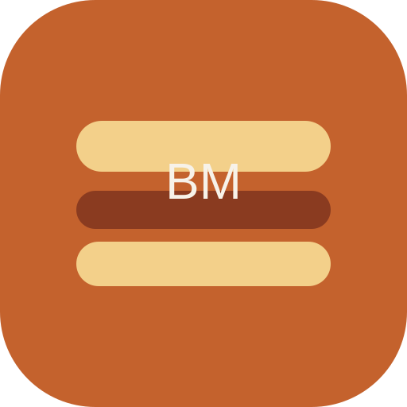

# BlendLab Burger

<p align="center">
  
</p>
<p align="center">
  
  
  
  
  
  
  
</p>

Criado por Anderson Marques Vieira da Hype Neural para amadores de hamburguer apaixonados e profissionais.

BlendLab Burger e um app mobile-first para criar blends de carne com precisao tecnica e linguagem simples. O foco e suculencia, textura, custo e repeticao. O app funciona offline, entrega explicacoes claras e guia o usuario do blend ate a receita completa.

## Visao geral
- App mobile-first com fluxo por etapas (escolher -> customizar -> receita).
- Builder com calculos em tempo real, alertas e explicacoes tecnicas.
- Modo offline real com cache de conteudo e fallback por rota.
- Interface otimizada para uso na cozinha (grandes toques, textos curtos).

## Fluxo principal (ASCII)
```
[Home/Presets]
     |
     v
[Builder/Lab] ---> [WikiMeat]
     |
     v
[Relatorio] ---> [Salvar | PDF | Compartilhar]
     |
     v
[Minha Grelha | Historico]

[Tools] -> Cooking Mode | Calibrar Alertas | Precos
```

## Objetivos do produto
- Ajudar qualquer pessoa a montar blends profissionais com alvo de gordura correto.
- Ensinar o "por que" de cada escolha (cortes, gordura, moagem e preparo).
- Gerar receita completa com lista de compras, pedido ao acougueiro e ficha de producao.
- Apoiar dono de hamburgueria com CMV, batch e padronizacao.

## Publico-alvo
- Amadores que querem acertar o hamburger na primeira tentativa.
- Chefs, churrasqueiros e profissionais que precisam de repeticao e qualidade.

## Stack tecnica
- React + TypeScript + Vite
- UI: Tailwind CSS + shadcn/ui + Radix
- Estado global: Zustand
- Persistencia: IndexedDB (Dexie)
- Graficos: Recharts (donut + radar)
- Animacoes: Framer Motion
- PWA: vite-plugin-pwa (service worker)
- Exportacao: html2canvas + jsPDF + Web Share API
- Icones: Lucide

## Funcionalidades (detalhado)

### Laboratorio (Builder)
- Stepper por etapas com CTA fixo para gerar receita.
- Selecionar cortes e ajustar percentuais com sliders.
- Modo avancado por gramas com "Normalizar para 100%".
- Alvo de gordura com Target Lock e explicacao passo a passo.
- Calculadora de proporcao reversa (2 cortes + gordura alvo).
- Indicador de gordura com status e faixa ideal.
- Alertas inteligentes por gordura, corte dominante, equipamento e estilo.
- Roda de sabores (radar) e donut de gordura (ocultos em modo economia).
- Extras separados do % principal (bacon, queijo, tutano, etc).
- Temperos sugeridos dinamicamente + personalizacao manual.
- Simulador de custo/CMV com preco sugerido por burger.
- Edicao de precos por ingrediente (ajuste por regiao).

### Relatorio final
- Lista de compras exata (pesos por ingrediente).
- Pedido ao acougueiro com moagem, gordura e observacoes.
- Ficha tecnica operacional (batch, pesos, moagem, rendimento).
- Estimativa nutricional por burger (calorias, proteina, gordura).
- Exportar PDF e compartilhar.

### Minha Grelha
- Blends salvos e historico local.

### WikiMeat
- Cards com informacao tecnica (colageno, oxidacao, maillard, dicas).
- "Ler mais" para detalhes e harmonizacoes.

### Ferramentas
- Cooking Mode com Wake Lock.
- Calibracao de alertas (Smash/Airfryer/Fit/Alto).
- Edicao de precos por ingrediente.

### Offline e baixa conexao
- Conteudo salvo em IndexedDB e seed inicial local.
- PWA instalavel com service worker.
- Fallback offline dedicado.
- Banner de offline e modo economia de dados (reduce animacoes/graficos).

## Exemplos praticos (blend assinatura e CMV)

### 1) Blend de assinatura (regional)
**Blend da Casa SC (ficticio)**
- 50% Acem (18% gordura)
- 30% Costela (18% gordura)
- 20% Cupim (25% gordura)

**Custo por kg (ficticio)**
- Acem: R$ 32.90/kg
- Costela: R$ 35.00/kg
- Cupim: R$ 46.00/kg

**CMV aproximado**
- Custo/kg = 0.5*32.90 + 0.3*35 + 0.2*46 = **R$ 36.15/kg**
- Burger 180g -> R$ 6.51 de custo
- CMV alvo 30% -> preco sugerido = 6.51 / 0.30 = **R$ 21.70**

### 2) Blend smash economico
- 70% Coxao duro (7% gordura)
- 30% Gordura de peito (90% gordura)

**Custo/kg (ficticio)**
- Coxao duro: R$ 36.00/kg
- Gordura de peito: R$ 18.00/kg
- Custo/kg = 0.7*36 + 0.3*18 = **R$ 30.60/kg**
- Smash 80g -> R$ 2.45 de custo
- CMV alvo 30% -> preco sugerido = 2.45 / 0.30 = **R$ 8.16**

### 3) Proporcao reversa (2 cortes)
**Meta: 20% gordura em 1 kg**
- Acem (18%) + Peito (22%)
- Resultado: **500g Acem + 500g Peito**

## Logicas e formulas (core)
- Gordura media ponderada:
  - totalFatGrams = soma(gramas_i * gordura_i)
  - fatPercentFinal = totalFatGrams / pesoTotal
- Target Lock (corrigir gordura com fonte):
  - x = (t * W - F) / (fat_j - t)
- Proporcao reversa (2 cortes):
  - pesoA = total * ((t - fatB) / (fatA - fatB))
  - pesoB = total - pesoA
- CMV:
  - custoTotal = soma(gramas_i/1000 * precoKg_i)
  - custoPorBurger = custoTotal / qtdBurgers
  - precoSugerido = custoPorBurger / (cmvAlvo/100)
- Yield (estimativa):
  - smash ~70%, grelha/churrasqueira ~72%, chapa ~78%, airfryer ~80%

## Dados e modelagem

### Cut (corte tecnico)
- gordura, colageno, oxidacao, maillard, custo, moagem, alertas e harmonizacao
- preco ficticio `avgPriceBrlKg` para simulacao de CMV

### Ingredient (ingrediente do blend)
- vincula ao `Cut` quando bovino
- gordura, macros, descricao curta e preco ficticio

### Presets e Seasonings
- presets com descricao, preparo e temperos base
- engine de temperos gera sugestoes e evita combinacoes ruins

### Preferencias do usuario (persistidas)
- targetFat, roundingStep, fatSourceId
- cmvTarget e priceOverrides
- alertThresholds (Smash/Airfryer/Fit/Alto)
- wakeLockEnabled

## IndexedDB (Dexie) - tabelas e indices
Banco: `blendMasterDB`

Versao 1
- `blends`: `id`, `createdAt`, `updatedAt`, `name`
- `history`: `id`, `blendId`, `createdAt`
- `preferences`: `key`, `updatedAt`

Versao 2 (atual)
- `cuts`: `id`
- `ingredients`: `id`, `category`
- `presets`: `id`, `category`
- `contentMeta`: `key`, `updatedAt`

Observacao: as preferencias guardam chaves como `targetFat`, `cmvTarget`, `alertThresholds`, `priceOverrides`, etc.

## Estrutura do projeto
- `src/pages`: telas principais e fluxo do app.
- `src/components`: componentes de UI e blocos do Builder.
- `src/data`: cuts, ingredientes, temperos e presets (seed local).
- `src/domain`: regras e logica do blend (engine de calculos e temperos).
- `src/lib`: helpers, matematica, storage e utilitarios.
- `src/store`: Zustand store para o estado do app.
- `src/hooks`: hooks utilitarios (wake lock, network status, etc).

## Scripts
```bash
npm run dev
npm run build
npm run preview
npm run lint
npm run test
```

## Reset de dados locais
Se precisar limpar os dados locais, apague o IndexedDB `blendMasterDB` no navegador.

## Observacoes
- Os precos por kg sao ficticios (simulacao) e podem ser ajustados na UI.
- O app e offline-first e nao requer backend.

## Roadmap
Consulte `tarefas.md` para o backlog e prioridades.

## Creditos
BlendLab Burger e uma criacao de Anderson Marques Vieira (Hype Neural).
